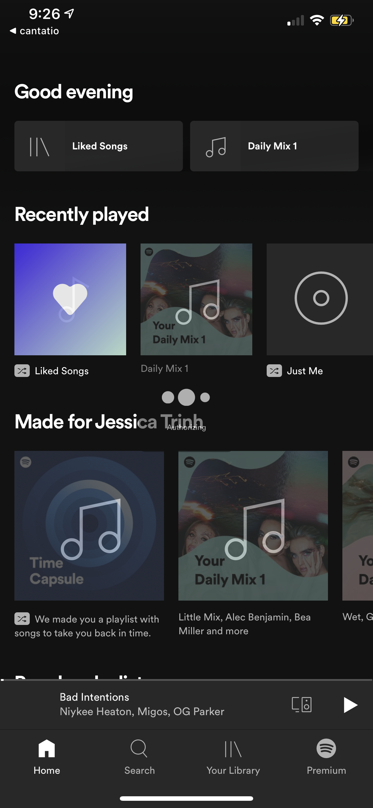
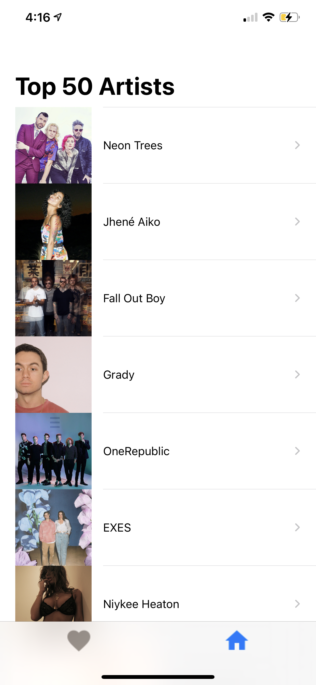
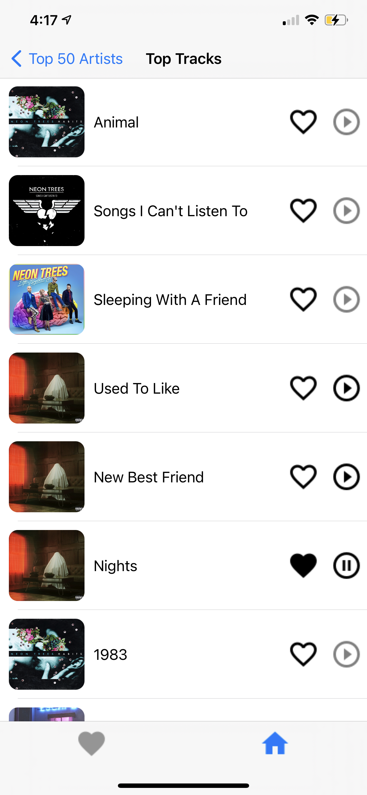
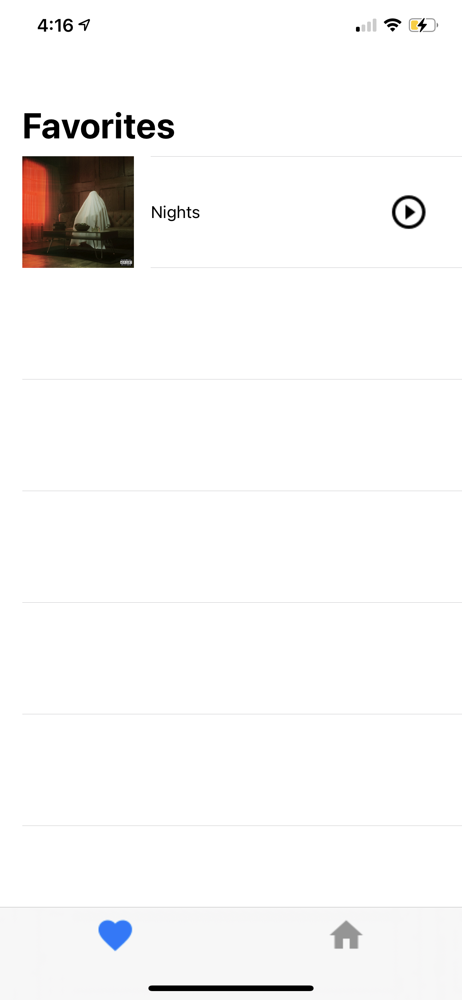

# Cantatio
Cantatio is a music player app that allows users to keep track of their top played artists, the artists' most popular tracks, and the user's favorited songs

# How does it work?

Users can login to Cantatio and sign in to their Spotify account with their personal credentials 

  

Once authenticated, Cantatio uses the [Spotify iOS SDK](https://developer.spotify.com/documentation/ios/) to get an access token that is then used by Cantatio to fetch the users data through various network calls  

  

## How to Install 
Note: Cantatio is still in the process of development. Check back here to stay up to date with the development process. 

In order to preview this app, you will need to clone this repository and open it in Xcode simulator 
 - If you do not have Xcode you can download it [here](https://developer.apple.com/xcode/)

## Tech Stack
* [Swift](https://developer.apple.com/swift/) - Programming language
* [Spotify API](https://developer.spotify.com/documentation/ios/) - Spotify iOS SDK
* [Xcode](https://developer.apple.com/xcode/) - The IDE used
* [Kingfisher](https://github.com/onevcat/Kingfisher) - 3rd party library
* [Spartan](https://github.com/Daltron/Spartan) - 3rd party library

# Future Lookouts 
- [ ] UI redesign & animation 
- [ ] Cross platform persistence & use 

# Initial Wireframes 

